# Data Lovers

## Preámbulo

Dos años después, la emoción del juego Pokémon Go sigue con más poder en los aficionados que en cualquier otro momento desde el lanzamiento del juego del verano 2016. El cazador como se le llama al usuario en el juego,  busca, captura y  en entrena a los Pókemons escondidos en el mundo real, para luchar por el control de "gimnasios" virtuales desplegados en lugares del mundo real que aparecen en los mapas de los smartphones. En este juego los creadores consideraron meter a solo 151 pokemones originales porque habría sido muy intrincado para atraer a nuevos fans meter a los  726 que hay en total.

En total hay 18 tipos de Pokémons, cada tipo generalmente corresponde a un hábitat específica, de manera que los Pokémons de tipo agua está precisamente en un hábitat con agua.
Un buen cazador cazador debe conocer bien  el tipo de sus Pokémons para calcular cual es más fuerte o débil frente a otro en una batalla. No obstante puede ser un poco confuso para los novatos por la gran cantidad de Pokémons.

## Definición del Producto

Del proceso de diseño

Con la información obtenida en las entrevistas se prosiguió ha crear los sketches con papel y lápiz plasmando la distribución de los elementos para la interfaz, y previniendo cómo el usuario interactuaría, luego se pidió a 3 usuarios que los revisaran para conocer qué tan intuitivo y amigable les parecía. Con los comentarios y sugerencias de los usuarios se encontraron aspectos a mejorar. Luego continuamos con la elaboración del prototipo de alta fidelidad con la herramienta Figma.
Con el feedback recibido se prosiguió con la implementación del producto con css, html y para su funcionalidad usamos el lenguaje de programación JavaScript. 	
   
¿Cómo crees que el producto resuelve el problema (o problemas) que tiene tu usuario?  

Creemos que el producto creado brinda información relevante acerca de los Pokémons para los jugadores de Pokémon Go y una serie de data que los ayudará a tomar decisiones más inteligentes a la hora de elegir un Pokémon o para aprender más sobre sus características.

## Principales usuarios del producto 

Los principales usuarios son los jugadores principiantes del juego Pokémon Go, quienes aún no conocen la amplia gama de pokemones del juego y las características más importantes para ser un buen entrenador.

## Objetivo de los usuarios

Los objetivos que buscan nuestros usuarios es una interfaz que le permita:

- Ver la lista de los pokemones del Juego con su foto, nombre, tipo al cual pertenece, número de caramelos y porcentaje de probabilidad de aparición
- Ordenar de manera ascendente o descendente a las pokemones según su nombre y número de id.
- Poder filtrar por el tipo de pokémon y por el número de caramelos de los Pokemones.
- Obtener el pokémon con el mayor porcentaje de aparición.

## Entrevista

Antes de elaborar las preguntas para la entevista definimos nuestro público objetivo tomando en cuenta la información de la data Pokémon proporcionada para el proyecto "Data lovers", en tal sentido la entrevista fue dirigida a personas que habían jugado y/o juegan Pokémon Go
para representar todo lo que el usuario necesitaría ver o hacer en nuestro producto plasmado en las historias de usuario. 
Considerando las mejores prácticas para la entrevista a usuarios formulamos preguntas para conseguir información siguiendo las siguientes etapas:  

* **Presentación: generamos confianza.**
Fuimos amables, casuales e informales para hacer sentir bienvenido y en confianza al entrevistado haciéndole saber lo que sucederá durante la entrevista y cuál es el objetivo que queremos conseguir con la misma; iniciando de esta manera la entrevista:

Hola soy Micaela/Ivana, ¿cómo estás?
¿De dónde eres?, ¿cómo fue tu día hoy?
Este periodo de tiempo, lo que quiero es que conversemos acerca de qué necesitarías ver en una aplicación web para ser mejor entrenador Pokémon.

* **Busca historias.**
En esta etapa las preguntas fueron dirigidas a fin de descubrir y conocer las necesidades del usuario y qué información mostrar en el producto a desarrollar.

1. ¿Cuáles son tus maneras de elegir un Pokémon?
2. ¿Qué necesitarías ver o saber exactamente sobre un Pokémon?

Para la primera pregunta recibimos estas respuestas:
Conocer su nivel.
Conocer su tipo de ataque. 
Saber si pueden evolucionar.

Mientras que para la segunda respondieron: 
Saber qué tipo es, si de agua o fuego por ejemplo.
Si todavía puede evolucionar.
Si un huevo va eclosionar.
La cantidad de caramelos para que evolucione un Pokémon.
Si determinado Pokémon contrarresta a otros en el gimnasio.

* **Hablen sobre sentimientos.**
¿Cuéntame sobre tu última experiencia jugando Pokémon Go? ¿fue buena, mala? ¿por qué dices eso?

Fue buena por el hecho de que cuando salí con mi familia a pasear a la playa encontré muchos Pokémons de agua y me causó mucha alegría.
Es muy entretenido salir con mis amigos en busca de los Pokémons.
Me gusta la aparición de 'Días de comunidad' ya que muchos aficionados se reunan en un determinado lugar y fecha donde puedo compartir experiencias con otros entrenadores.

### Encuesta 

Para complementar más las investigación sobre la necesidades de los usuarios del juego Pokémon Go, hicimos una **encuesta** con la herramienta Google forms para jerarquizar la información más relevante que desea saber el público objetivo.

[Link a nuestra Encuesta](https://docs.google.com/forms/d/e/1FAIpQLSeosWC9LZtFqn39gnxNlxbC6KX5aiEcmkozPMS-CCaWYBS4Dw/viewform)

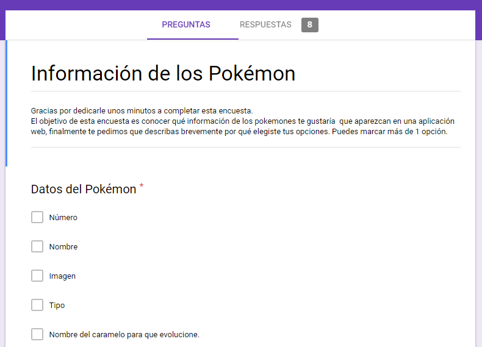

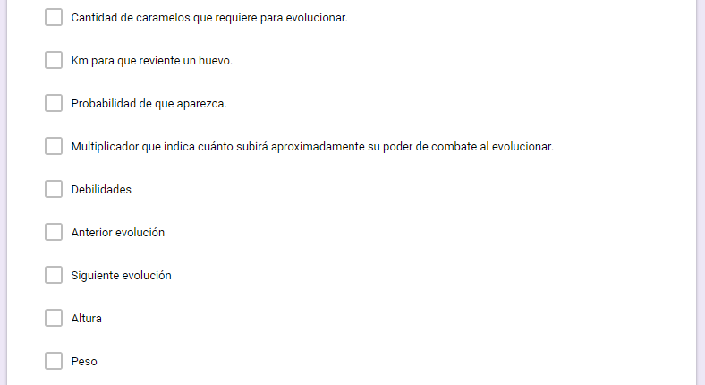

**Obtuvimos los siguientes resultados:**

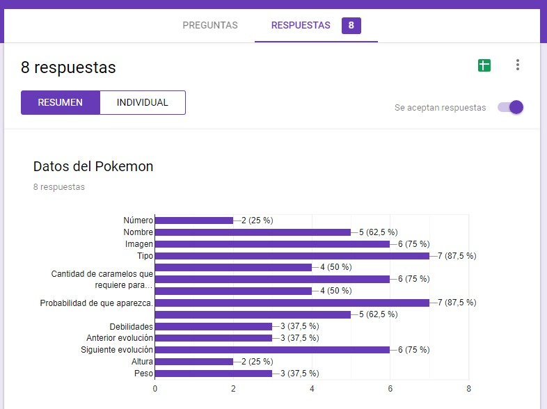
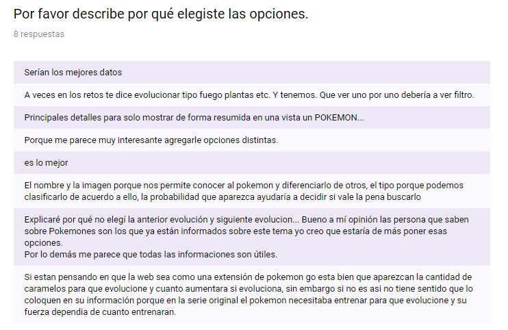

## Historias de usuario

### Historia 1:

**Yo como:** usuario de la aplicación web.  

**Quiero:** ver número, nombre, imagen, tipo, y probabilidad que aparezca.

**Funcionalidad:** para tener una vista rápida de la información disponible de los Pokémons.

**Definición de Terminado:** el usuario al abrir la aplicación web podrá visualizar la lista de todos los Pokémons que incluye los siguientes datos: número, nombre, imagen, tipo, y probabilidad que aparezca.

### Historia 2:

**Yo como**: usuario de la aplicación web.

**Quiero**: ordenar los Pokémons por nombre ascendente y descendente.

**Funcionalidad**: para buscar y conocer más rápido a los Pokémons.

**Definición de Terminado:** el usuario podrá seleccionar si ordenar por nombre de manera ascendente o descendente.  

### Historia 3:

**Yo como**: usuario de la página web.

**Quiero**: filtrar por tipo a los Pokémons.

**Funcionalidad**: para identificarlo, conocerlo y para saber si un Pokémon es de más de un tipo.     

**Definición de Terminado:** el usuario podrá seleccionar qué tipo de Pokémons filtrar.

### Historia 4:

**Yo como**: usuario de la página web.      

**Quiero**: ver el Pokémon que tiene la mayor probabilidad que aparezca.    

**Funcionalidad**: para saber si es oportuno buscar un Pokémon.   

**Definición de Terminado** el usuario al hacer click en el botón con la descripción mayor % de aparición le mostrará dicha información.

## Diseño de la Interfaz de Usuario

### Prototipo de baja fidelidad

Luego de las entrevista  realizamos un sketch o boceto de lo que sería el producto teniendo en cuenta la necesidad principal del usuario que era conocer todos los tipos de Pokémons y saber si un Pokémon tiene más de un tipo.

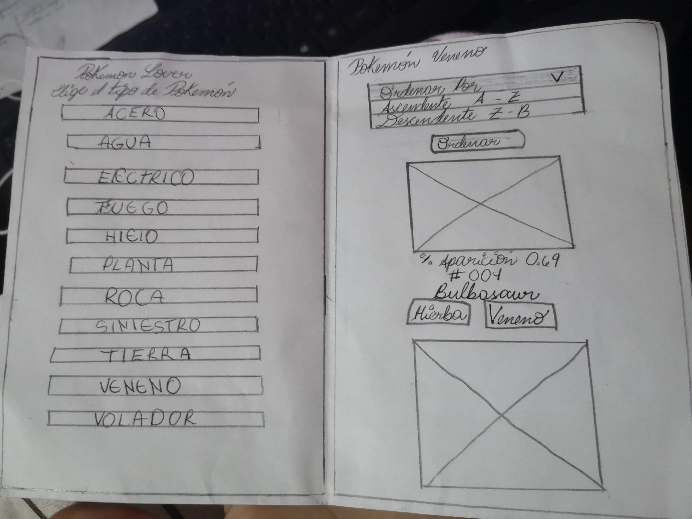

### Testeo de usabilidad
Teniendo los sketchs ya mencionados, creímos conveniente ralizar una prueba de testeo es así que pedimos a 3 usuarios que los revisaran para detectar qué tan intuitivo y amigable les parecía.
Posterior al testeo estas personas nos dieron su opinión y nos dijeron qué deberíamos modificar, de tal forma que detectamos los siguientes problemas:

* Los usuarios quieren ver primero toda la lista de pokémons sin ningún filtro.
* Un cálculo sobre que Pokémons necesitan más o menos caramelos para evolucionar y se calcule justo en el mismo tag select donde se ordena a los Pokémons por nombre de la A-Z y de la Z-A.

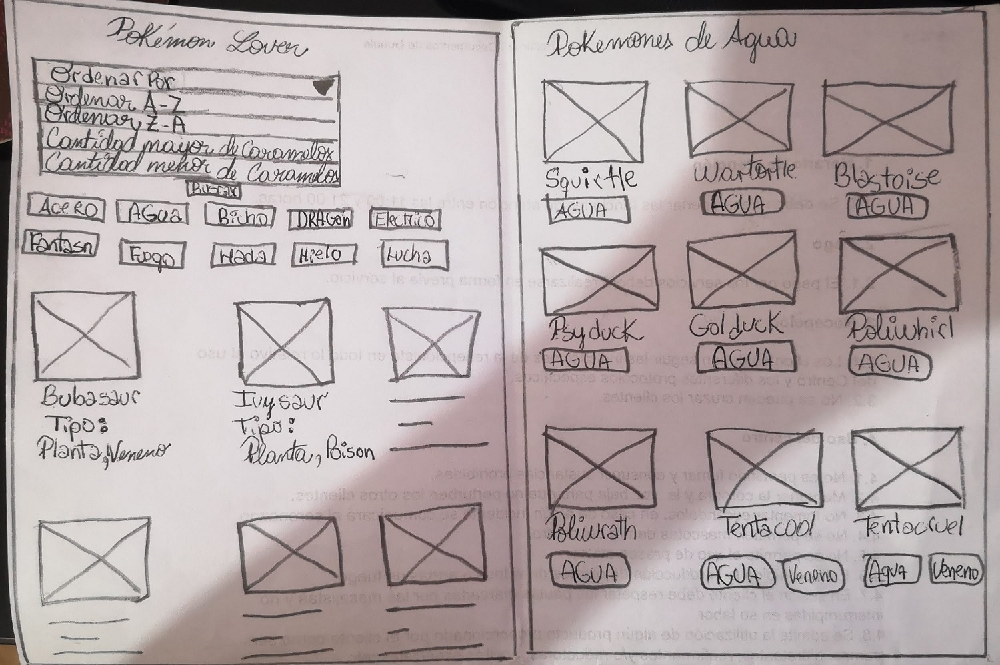

### Prototipo de alta fidelidad

Diseñamos un prototipo con la Herramienta [_Figma_](https://www.figma.com/)

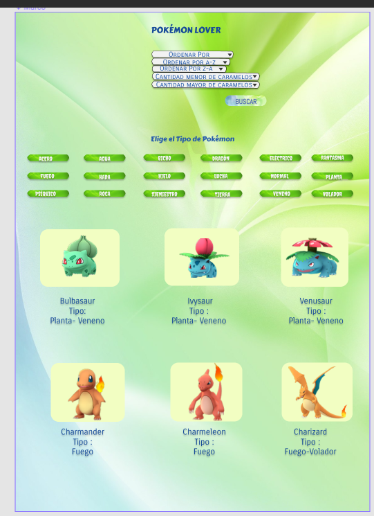

 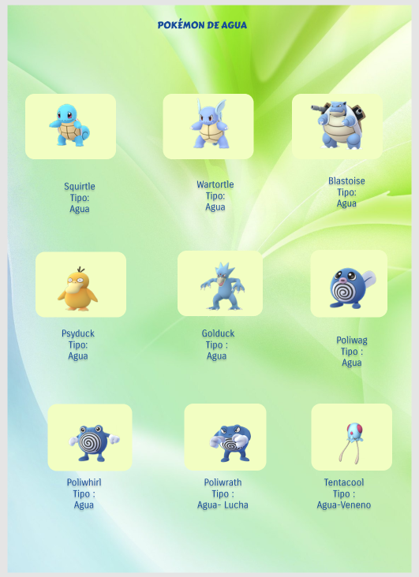

### Testeo de usabilidad

Al testear nuestro prototipo lo usuarios nos sugirieron las siguientes mejoras: 
* Hacer más interactivo el prototipo en especial la forma del select porque parecían ser varios select o botones.
* Eliminar el botón de buscar porque al dar click en las opciones del select automáticamente se ordena.
* Y por último dar un color mas oscuro a los botones de tipos de Pokémons para hacer más contraste con las letras.

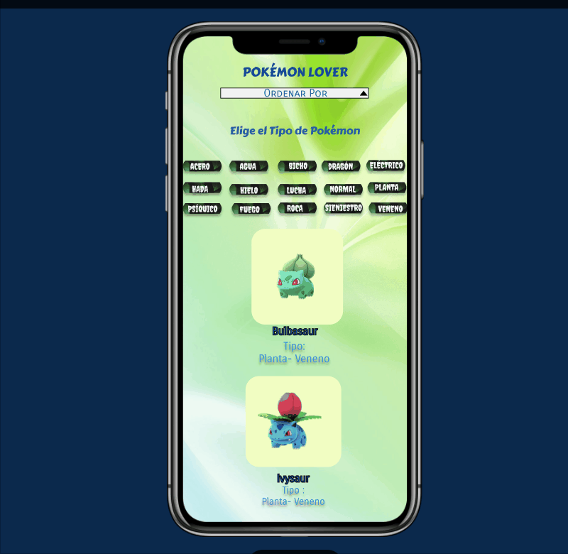

### Testeo de usabilidad

Una vez realizados nuevos test, se concluye que es necesario: 
* Añadir un **logo** al producto para hacerlo más amigable.
* Cambiar la **imagen fondo**, ya que le robaba protagonismo a la cards de los pokemones.
* Cambiar la **paleta de colores**.

### El diseño prototipo en Figma se exportó a [Zeplin](https://zeplin.io/)

1. Primero se integró con el plugin de Zeplin.
2. Luego se exportó el diseño.
3. Y al exportar nos salió la opción para exportar todo el prototipo a Zeplin.
4. Zeplin nos proporcionó indicaciones de estilo como: el alineado, su tamaño, tipografía y colores de cada elemento para agilizar el proceso de maquetación.
[Link de Zeplin](https://zpl.io/29oKr6w).

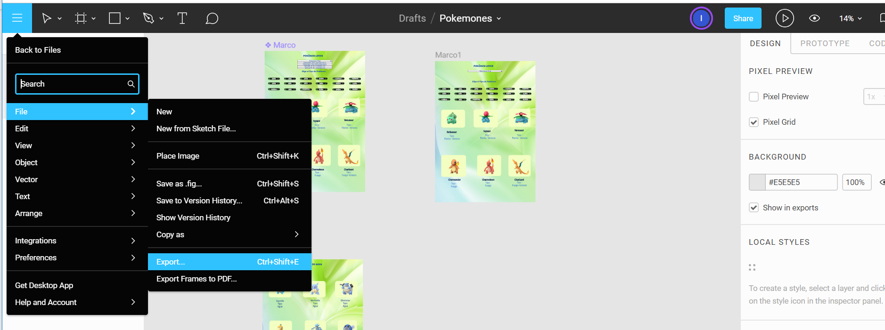
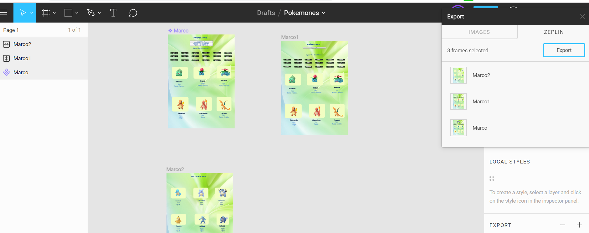

 
### Paleta de Colores

Nos guiamos del logo del juego Pókemon Go para definir la paleta de colores, este proceso fue apoyado con el uso de la herramienta de Adobe Color CC, importando la imagen del logo para obtener sus colores. **Y sus códigos Hex son:**.
<!--  -->

Se realizó otra iteración con otra imagen de fondo, se agregó un logo y una paleta de colores:
[Link de Figma](https://www.figma.com/file/0gcygDZ86Prvn7Fi4tQ4CyjB/3ra-iteraci%C3%B3n-de-Pokemon-Lovers?node-id=33%3A13).

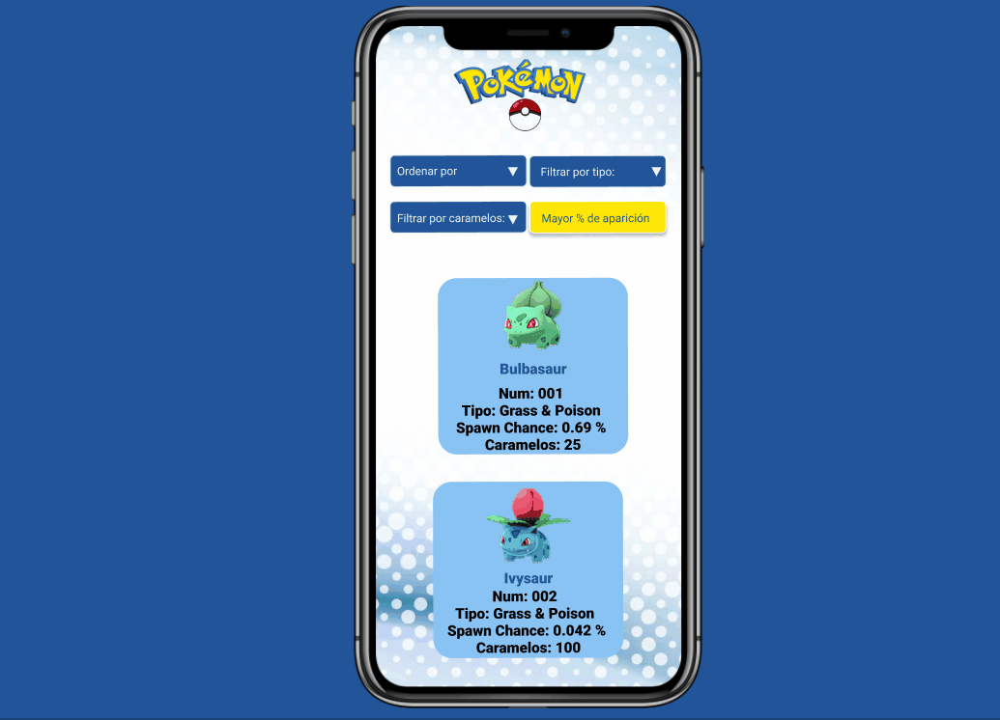

### Testeo de usabilidad

**Conclusiones:**

* Todos los usuarios sugirieron añadir un botón scroll que suba rápidamente hacia arriba, ya es muy incomodo estar subiendo bastante con el scroll del mouse.
* Se ha visto que el logotipo quita mucho espacio en la pantalla por lo que se debería disminuir el tamaño del logotipo.
* Con respecto al diseño uno de los usuarios sugirió agregar un Menú de navegación y un Footer para darle más personalidad al sitio web.
* Para los pokemones que no cuenta con cantidades de caramelos en vez de usar **undefined**, usar otro término que oriente la usuario porque no recibe lo que espera.

Al detectar los problemas de usabilidad se realizó la cuarta iteración en version mobile:

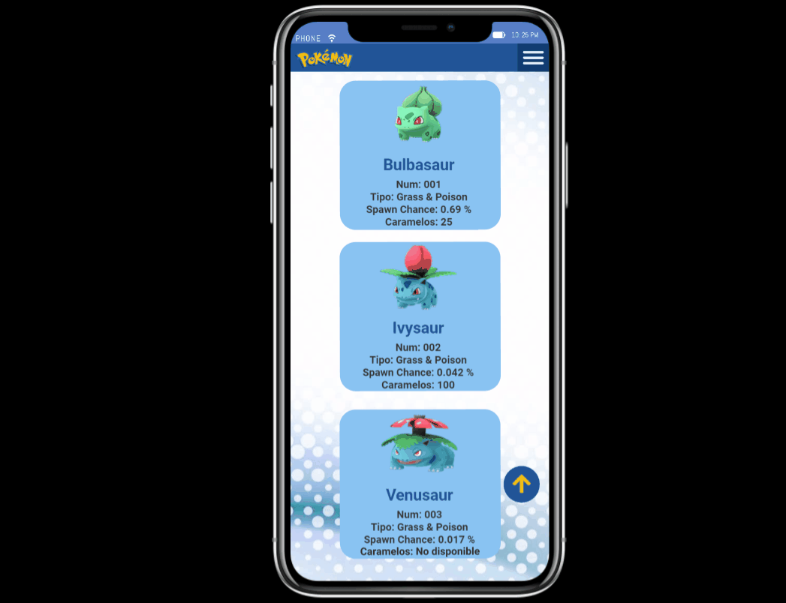
